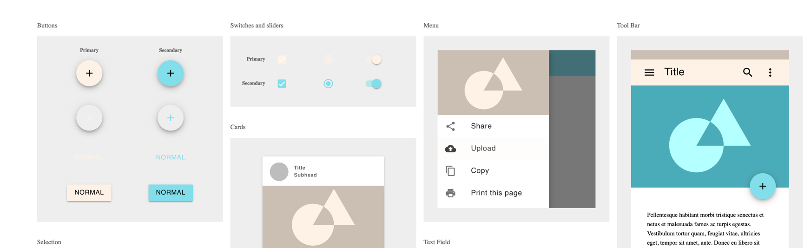

# TradingStrategy.ai website frontend

This is a source code for [SvelteKit website](https://kit.svelte.dev/docs) based website that shows real-time information on available [Capitalgram datasets](https://mightyeagle.capitalgram.com/datasets).

## Install

Node v14+ required.

```sh
npm install
```

## Building the theme

Theme is available as a separate git submodule. 
It is based on a MIT licensed [Neumorphism UI by Themesberg](https://github.com/themesberg/neumorphism-ui-bootstrap).
The theme is Bootstrap v4 based.

Pull the submodule

```shell
git submodule update --init --recursive
```

Then

```shell
cd theme
npm install
npx gulp build:dist
```

This will produce files in `theme/dist` folder.

## Running in local dev

```shell
npm run dev
```

## Running on production

This will run server-side generated (SSR) pages.

```shell
screen -S frontend
export PRODUCTION=true 
npm install
(cd theme && npm install && npx gulp build:dist)
node_modules/.bin/svelte-kit build && node build/index.js
```

[Port troubleshooting](https://www.tecmint.com/find-out-which-process-listening-on-a-particular-port/)

```shell
netstat -ltnp | grep -w ':80' 
```

## Theme development

You can also open the theme development server:

```shell
npx gulp
```

Editing theme mainly happens in `theme/src/scss/neumorphism/_variables.scss`.

Palette tools: https://material.io/resources/color/#!/?view.left=0&view.right=1&primary.color=eeb302&secondary.color=80DEEA



## More information

* https://docs.capitalgram.com/

