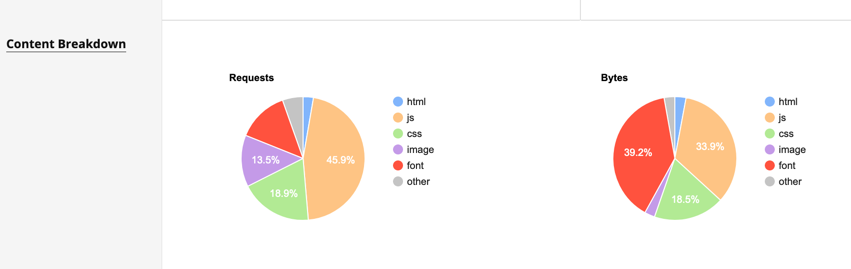

# Page speed tests

Page speed utilities to see First Contentful Paint (FCP) and Largest Contentful Paint (LCP) events.

* https://pagespeed.web.dev
  * Example: https://pagespeed.web.dev/report?url=https%3A%2F%2Ftradingstrategy.ai%2Ftrading-view%2Fbinance%2Fpancakeswap-v2%2Fdgt-bnb
* https://www.webpagetest.org/
  * Example: https://www.webpagetest.org/result/211230_BiDc5M_0b72ec65b0eb6523fddb06496ab832d4/1/details/#waterfall_view_step1

## Enabling early hint testing 

https://blog.cloudflare.com/early-hints/#testing-early-hints-with-web-page-test

# Mobile friendliness tests

* https://search.google.com/test/mobile-friendly
  * Example https://search.google.com/test/mobile-friendly?url=https%3A%2F%2Ftradingstrategy.ai%2Ftrading-view%2Fbinance%2Fpancakeswap-v2%2Fbillntedsupsidedownbackwardsmatrixmetaverse5000xinu-bnb&url=https%3A%2F%2Ftradingstrategy.ai%2Ftrading-view%2Fbinance%2Fpancakeswap-v2%2Fbillntedsupsidedownbackwardsmatrixmetaverse5000xinu-bnb&hl=en

# Mobile font cheat - Cheating on the Largest Contentful Paint (LCP) event

The largest contentful paint event is a measure Google uses to
rank pages up in its search listing. Because we have exchausted pretty much every other speed optimization on the page,
the LCP on slow mobile connections is mostly driven by font downloads (see `/static/fonts.css`).
Note that this is 

- Only concern for slow connections - fast connections do LCP with fonts under one second
- Not a real concern for users because we use `font-display: swap`

... however Google still bugs on mobile LCP if it falls below 2500 ms.

What we do is that we cheat our way through. We only want to load fonts on fast connections.
However, we cannot detect this in the client. Thus, we load fonts only when we detect a mobile screen,
shaving off 500 ms from our "Google mobile LCP" and getting perfect Core Web Vitals score on the website.

The downside is, of course, that we do not have proper styling with fonts on mobile.
However I consider Core Web Vitals score more important than artistic essence of the website
on mobile.


			 
# Analyzing vendor.js bundle

* https://www.npmjs.com/package/source-map-explorer

An example:

```
npm install -g source-map-explorer
rm -rf build && node_modules/.bin/svelte-kit build
source-map-explorer build/client/_app/chunks/vendor-*.js
```